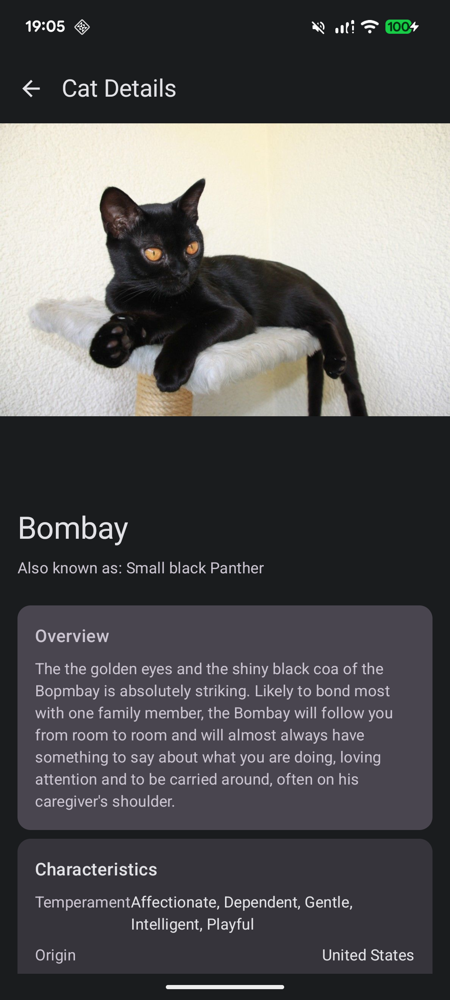

# 🐱 gkCatInfoSampleApp

Kotlin Multiplatform (KMP) と Compose Multiplatform を使用した猫の情報を表示するサンプルアプリケーションです。

## 📱 スクリーンショット

<p align="center">
  
  
</p>

## 🎥 デモ動画

<p align="center">
  <video src="docs/record_screen.mov" width="300" controls>
    アプリのデモ動画
  </video>
</p>

## 🚀 機能

- 様々な猫の品種を写真ギャラリーで表示
- 猫の写真をタップして詳細情報を表示
- スムーズなアニメーション遷移
- Android と iOS の両プラットフォームで動作

## 🛠️ 技術スタック

- **Kotlin Multiplatform**: バージョン 2.2.0
- **Compose Multiplatform**: バージョン 1.8.2
- **Android SDK**: compileSdk 35, minSdk 24, targetSdk 35
- **JVM Target**: Java 11
- **アーキテクチャ**: MVVM パターン
- **ネットワーク**: Ktor Client
- **画像読み込み**: Coil
- **API**: [The Cat API](https://thecatapi.com/) - 猫の画像と品種情報を提供

## 📂 プロジェクト構造

```
gkCatInfoSampleApp/
├── composeApp/           # 共有コードモジュール
│   ├── src/
│   │   ├── commonMain/   # プラットフォーム共通コード
│   │   ├── androidMain/  # Android 固有コード
│   │   └── iosMain/      # iOS 固有コード
│   └── build.gradle.kts
├── iosApp/               # iOS アプリケーション
├── docs/                 # ドキュメント画像
└── gradle/               # Gradle 設定
```

## 🏗️ ビルド方法

### 前提条件

- JDK 11 以上
- Android Studio または IntelliJ IDEA
- Xcode (iOS ビルド用)

### Android

```bash
# デバッグビルド
./gradlew assembleDebug

# デバイス/エミュレータへインストール
./gradlew installDebug
```

### iOS

```bash
# iOS シミュレータ用ビルド
./gradlew iosSimulatorArm64Test
```

または Xcode で `iosApp/iosApp.xcodeproj` を開いてビルド

## 🧪 テスト実行

```bash
# 全テスト実行
./gradlew allTests

# Android ユニットテスト
./gradlew testDebugUnitTest

# iOS テスト
./gradlew iosSimulatorArm64Test
```

## 📱 主要なコンポーネント

### データ層
- `CatRepository`: 猫データの取得を管理
- `CatApiService`: 外部 API との通信
- `HttpClientFactory`: プラットフォーム固有の HTTP クライアント設定

### プレゼンテーション層
- `CatViewModel`: ギャラリー画面のビジネスロジック
- `CatDetailViewModel`: 詳細画面のビジネスロジック
- `App.kt`: メインの UI エントリーポイント

### ナビゲーション
- Compose Navigation を使用したシームレスな画面遷移
- 共有要素アニメーションによる滑らかな画面切り替え

## 🔧 開発コマンド

```bash
# コード品質チェック
./gradlew lint

# 全検証タスク実行
./gradlew check

# プロジェクトビルド
./gradlew build
```

## 📄 ライセンス

このプロジェクトはサンプルアプリケーションです。